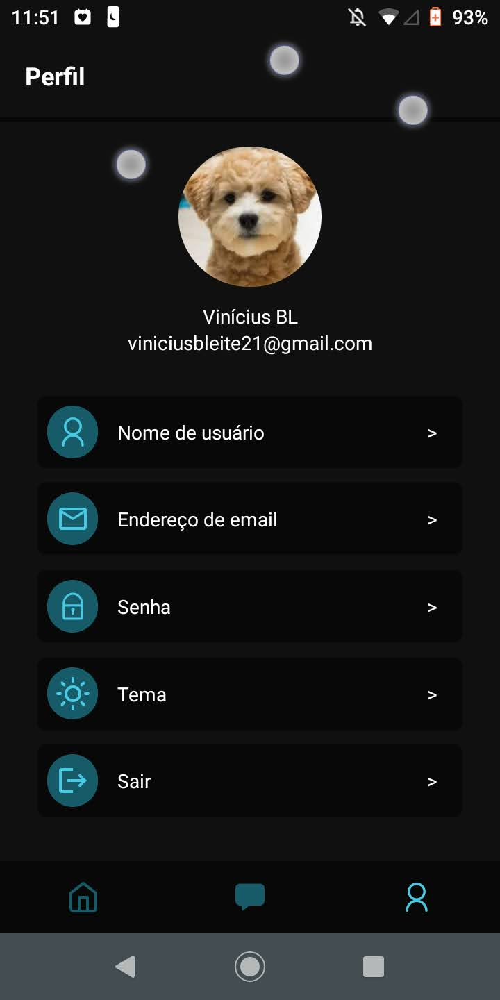

# BL HOMEWORKS
O BL Homeworks é um aplicativo desenvolvido em React Native com o objetivo de gerenciar tarefas escolares com muita facilidade e praticidade

## Principais Tecnologias
>
Aqui está as tecnologias usadas no projeto

 - react-native 0.70.6
 - styled-components 5.3.6
 - gorhom/bottom-sheet 4.4.5
 - axios 1.2.2
 - react-native-document-picker 8.1.3
 - react-navigation 6
 - react-native-firebase/app 16.5.0
 - react-native-gesture-handler 2.8.0
 - react-native-linear-gradient 2.6.2
 - react-native-reanimated 2.13.0

 
 ## Serviços usados
  
  - Github
  - Firebase
  - Render

### Screenshots
  
  
  
  
  
  
  
  
  
  
  
  
  

## Funcionalidades

As principais funcionalidades são:
 - Criar ou entrar em uma sala
 - Criar tarefas
 - Visualizar as tarefas e abrir os materiais de apoio
 - Marcar ou desmarcar tarefa como realizada
 - Conversar pelo chat
 - Trocar de foto, nome, email ou senha
 - Trocar de tema (escuro e claro)

## Links
 - LinkedIn:  www.linkedin.com/in/vinicius-b-leite
 - Repositório: https://github.com/Vinicius-B-Leite/blhomework
 - Em casos de bugs, por favor me contate
  viniciusbleite21@gmail.com

## Status
  Fase de teste
  
## Versão
 1.0.0

## Autor
Feito com <3 por Vinicius B. Leite